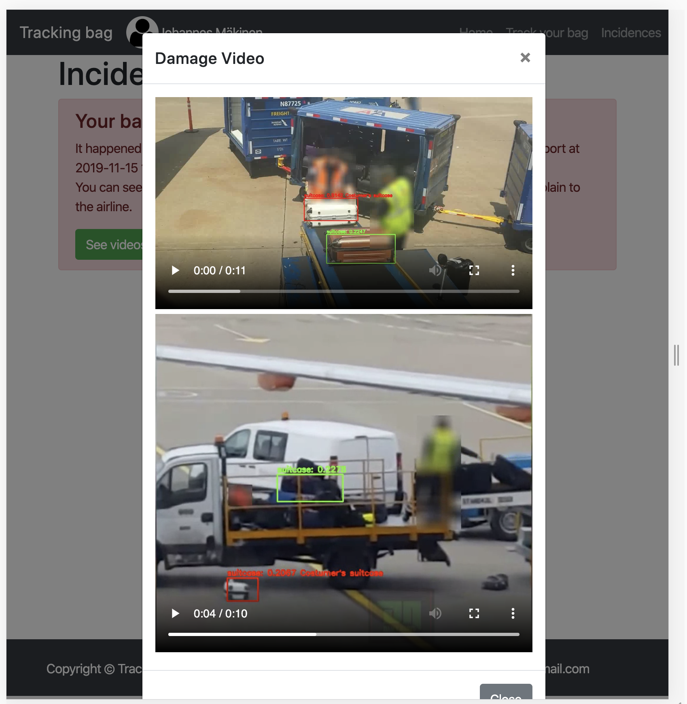
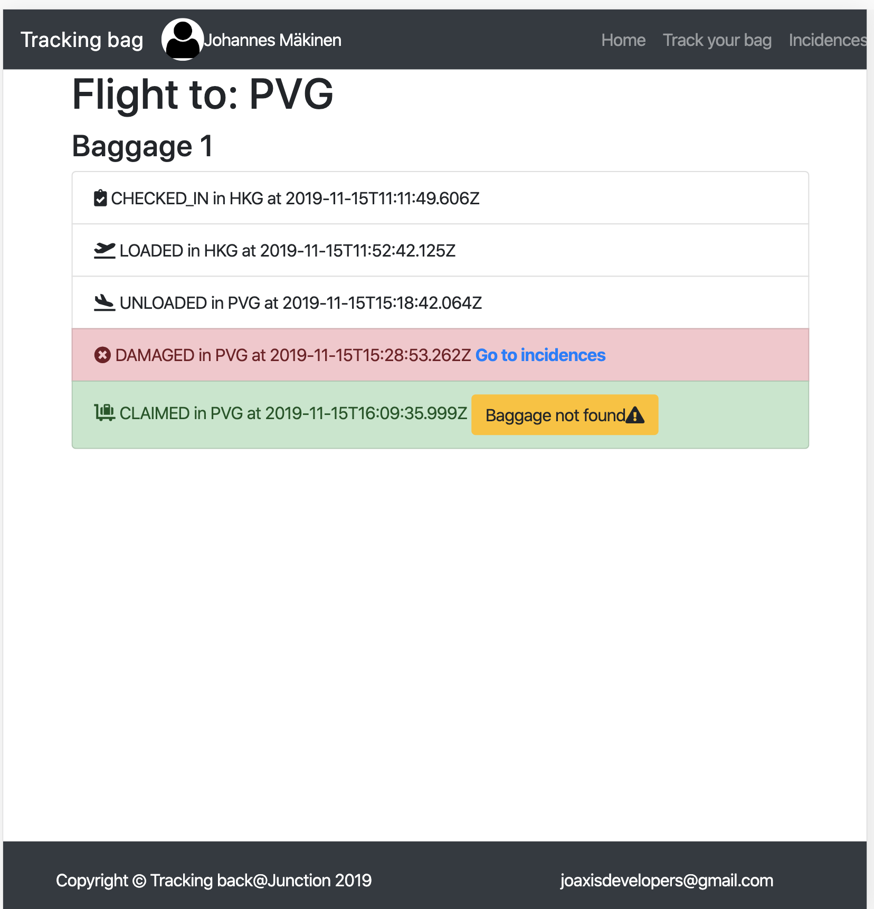
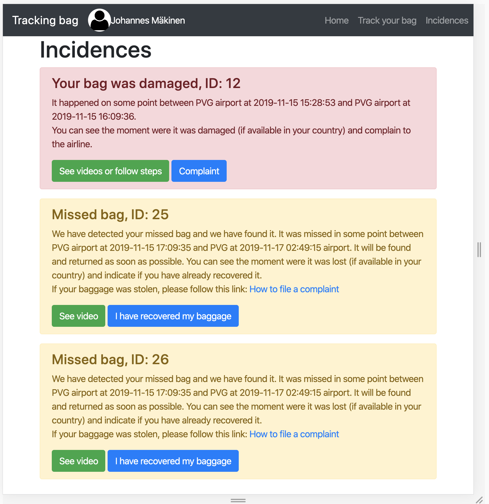
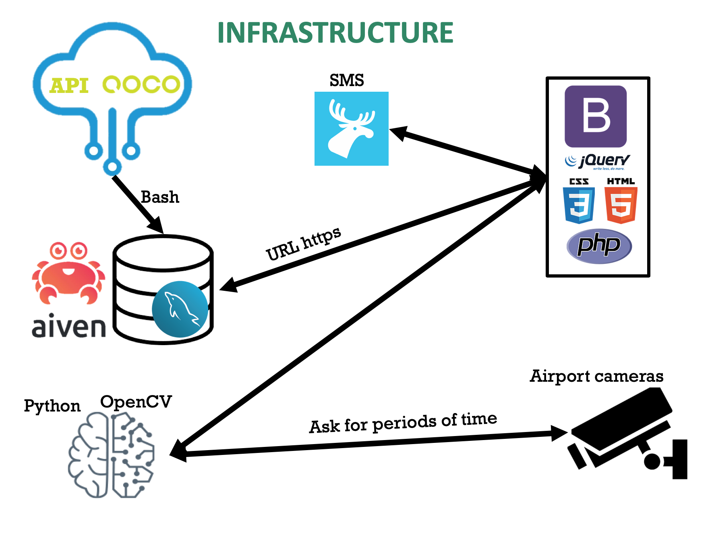

# Tracking Bag 
## The ultimate solution in baggage tracking to improve travelers experience. 
Track: Future cities

Challenge: Smooth Travels

https://2019.hackjunction.com/challenges/smooth-travels

https://github.com/QOCOSystems/junction-2019-api-doc

# General idea:
Tracking Bag is based on a web application that provides continuos information to the customers about the status of their luggage. When an incident happens, thanks to our image recognition algorithm, it is possible to obtain information about the cause of the issue and guides the customer along the steps required to solve it.

# Our product:
Tracking Bag App increases travelers tranquility while traveling. Thanks to this application, customers have continuous information about where and how their luggages are. 

Currently, airlines are able to detect missing suitcases if they have been lost during the journey, but, how much time does it take to detect where they are and what have happened to them? Or even more, what happens with the stollen suitcases?

Thanks to Tracking Bag App and our object detection based algorithm, we are able to detect the concrete moment in time where the incident has happened. Additionally, we guide the costumer on the following steps required to retrieve the suitcase.

# Development of the proof of concept prototype
We have develope a proof of concept prototype in order to test and demostrate the technology.  

